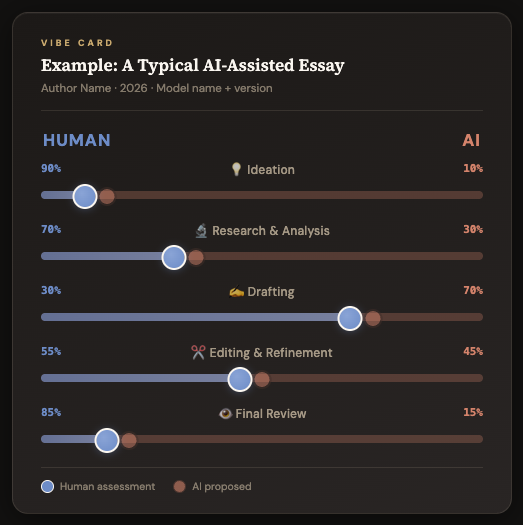

# Vibe Card

A transparency standard for human–AI collaboration. Vibe Cards sit at the top of essays, reports, and other intellectual work products to show how much was done by a human vs. an AI — inspired by the [CRediT (Contributor Roles Taxonomy)](https://credit.niso.org/) used in scientific publishing.



## What It Is

A small visual card with sliders across several dimensions of contribution:

- **Ideation** — Who came up with the core ideas?
- **Research & Analysis** — Who gathered data, ran analyses, found sources?
- **Drafting** — Who wrote the text?
- **Code** — Who wrote any code involved? (Optional dimension.)
- **Editing & Refinement** — Who reviewed and improved the work?
- **Final Review** — How thoroughly did a human review the final product?

Each slider ranges from fully human (left) to fully AI (right). The card also records the specific AI model and version used.

## Features

- **Interactive sliders** — drag to set contribution levels for each dimension
- **Dual-dot mode** — optionally show both the AI's proposed values and the human's final values
- **PNG export** — save a transparent-background image to embed in your work
- **Customizable dimensions** — enable/disable dimensions as needed (e.g. hide "Code" for a pure writing project)

## Usage

### As a React component

```jsx
import VibeCard from './VibeCard';

// Define your card data
const myCard = {
  title: "My Essay Title",
  author: "Your Name",
  model: "Claude Opus 4.6 (Anthropic)",  // Be specific!
  date: "February 2026",
  // AI's proposed values (0 = fully human, 100 = fully AI)
  ai: { ideation: 20, research: 40, drafting: 75, code: 0, editing: 50, review: 15 },
  // Human's adjusted values
  human: { ideation: 15, research: 35, drafting: 70, code: 0, editing: 45, review: 10 },
  enabledDimensions: ["ideation", "research", "drafting", "editing", "review"],
};
```

### Quick start with the interactive tool

1. Open `VibeCard.jsx` in any React environment (or paste into Claude's artifact viewer)
2. Use the "Custom" preset
3. Drag the sliders
4. Click "Save as PNG"
5. Embed the image at the top of your essay

## Model Verification

AI models are bad at self-identification. When asking an AI to help generate your Vibe Card, include this prompt:

```
Before filling in the model field on this Vibe Card:
1. State your exact model name and version string
   (e.g. "Claude Opus 4.6", "GPT-4o", "Gemini 2.0 Flash")
2. State today's date
3. Do NOT guess or round — if you are uncertain of
   your own version number, say so explicitly
4. The human will verify and correct if needed
```

## Adopt the Standard

You don't have to use these exact categories or this exact design. The point is to put *something* at the top of AI-assisted work that says how much was you and how much was the machine. The norms we set now will matter.

## License

MIT — use it however you want.
